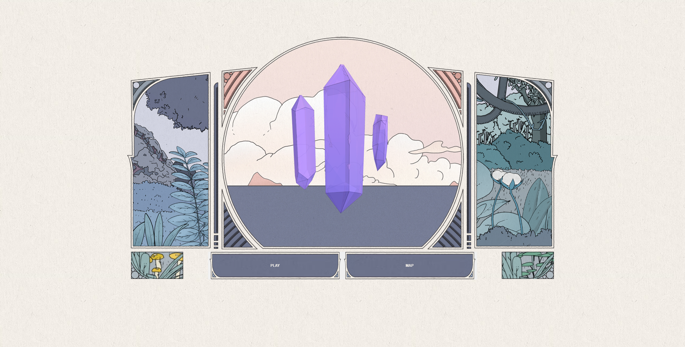

# DnD Project



**DnD Project** is a React-based application that showcases 3D rotating crystals rendered with Three.js. Designed to be both visually appealing and performant, this project includes various optimizations to ensure a smooth, responsive user experience.

## Table of Contents

- [Installation](#installation)
- [Usage](#usage)
- [Project Structure](#project-structure)
- [Technologies Used](#technologies-used)
- [Optimization](#optimization)
- [License](#license)

## Installation

Follow these steps to set up and run the project locally:

1. **Clone the repository:**

   ```sh
   git clone https://github.com/JohnImril/dnd.git
   cd dnd
   ```

2. **Install dependencies:**

   ```sh
   npm install
   ```

## Usage

To start the development server:

```sh
npm start
```

The application will be available at [http://localhost:3000](http://localhost:3000), running on `webpack-dev-server` with hot module replacement enabled.

To build the project for production:

```sh
npm run build
```

This command creates a production-ready build in the `dist` directory.

## Project Structure

Below is an overview of the project's file organization:

```
dnd/
├── src/
│   ├── assets/
│   │   └── img/
│   ├── components/
│   │   ├── Button/
│   │   │   ├── Button.tsx
│   │   │   └── Button.css
│   │   └── RotatingCrystals/
│   │       ├── RotatingCrystals.tsx
│   │       └── RotatingCrystals.css
│   ├── textures/
│   │   └── crystal.jpg.dds
│   ├── models/
│   │   └── scene.glb
│   ├── App.tsx
│   ├── App.css
│   ├── index.tsx
│   └── index.html
├── .babelrc
├── .gitignore
├── package.json
├── tsconfig.json
├── webpack.config.js
└── README.md
```

## Technologies Used

- **React**: A popular JavaScript library for building interactive user interfaces.
- **Three.js**: A powerful 3D library that simplifies working with WebGL for rendering the rotating crystals.
- **Webpack**: A versatile module bundler that streamlines building, bundling, and optimizing assets.
- **Babel**: A JavaScript compiler that enables the use of modern JavaScript features.
- **TypeScript**: A typed superset of JavaScript that improves code quality and maintainability.

## Optimization

This project employs several optimization techniques to ensure efficient rendering and performance:

1. **Memoization**: React components and functions are wrapped with `React.memo`, `useCallback`, and `useMemo` to prevent unnecessary re-renders.
2. **Optimized Webpack Configuration**: The production build is optimized through minification, code splitting, and other performance-focused settings.

### Example Optimization

The `RotatingCrystals` component utilizes `React.memo` to minimize re-renders when its props and state remain unchanged:

```typescript
const RotatingCrystals: React.FC = React.memo(() => {
  // Component logic here
  return (...);
});
```

## License

This project is licensed under the [MIT License](LICENSE). Refer to the license file for more information.
